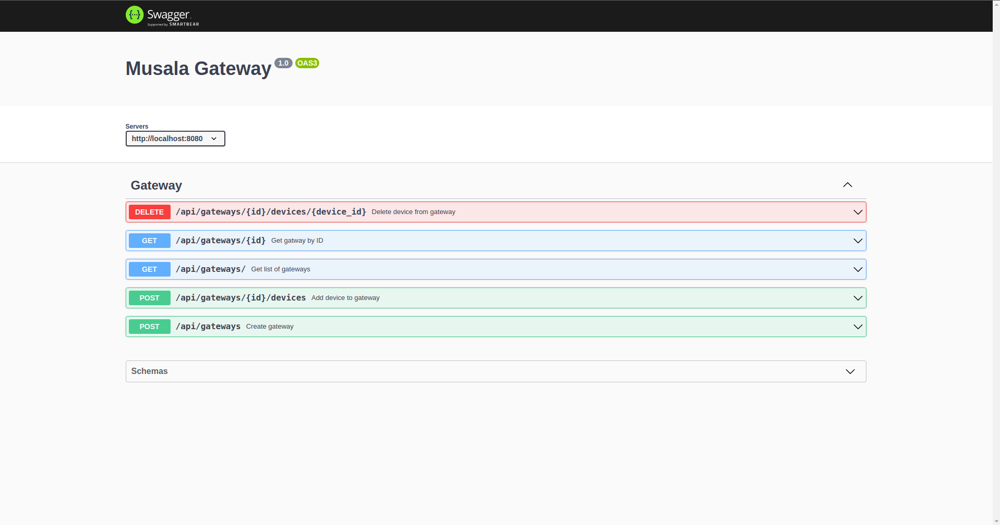
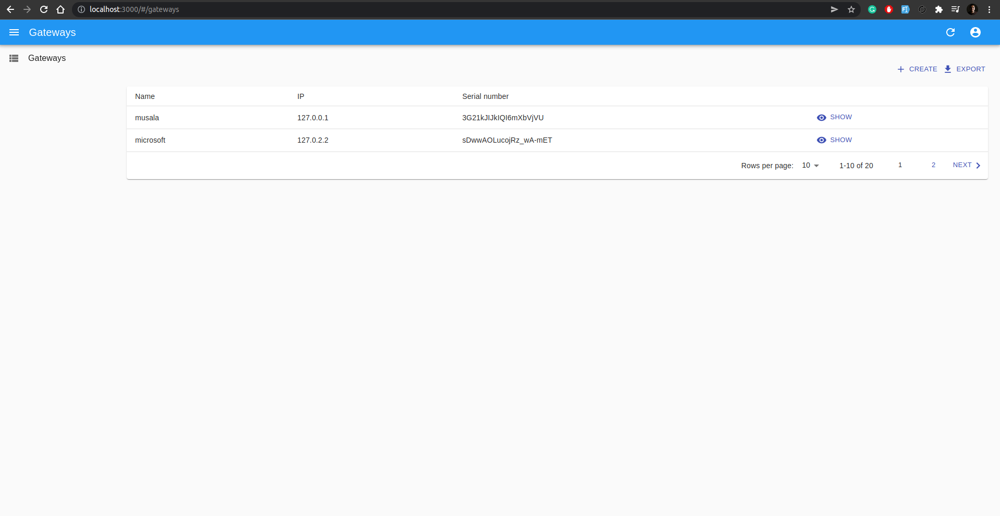

## SUMMARY

Basic API gateway & dashboard

## Technology stack
- NodeJS
- ReactJs
- MongoDB

## Installation
- Clone the project
- Run `docker-compose up`

## Links
- API: http://localhost:8080/
- Swagger API Documentation: http://localhost:8080/api-docs/
- Dashboard: http://localhost:3000/

## Screenshots
- ### API docs
- 

- ### Dashboard
- 
